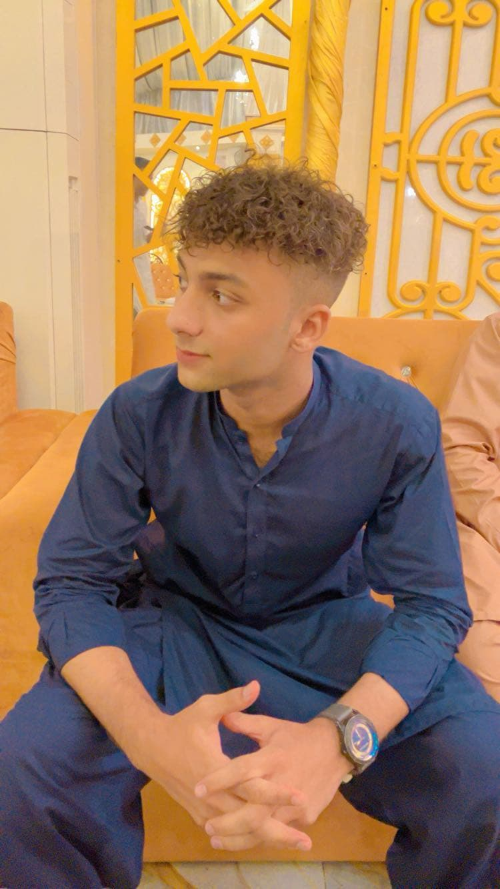

# Syed Aryan Ali Shah - Portfolio



A modern, responsive portfolio website showcasing my projects, skills, and contact information.

## 📋 Features

- **Modern UI Design**: Sleek and professional design with subtle animations
- **Responsive Layout**: Fully optimized for all screen sizes
- **Interactive Components**: Animated sections and interactive UI elements
- **Skills Showcase**: Visual representation of technical proficiencies
- **Project Gallery**: Filterable project display with details and links
- **Contact Form**: Easy-to-use contact form with email integration

## 🛠️ Built With

- **React**: UI library for building component-based interfaces
- **TypeScript**: Type-safe JavaScript for better development experience
- **Tailwind CSS**: Utility-first CSS framework for custom designs
- **Vite**: Fast build tool and development server
- **shadcn-ui**: Beautifully designed components built with Radix UI and Tailwind
- **EmailJS**: Email service for contact form functionality
- **Lucide Icons**: Simple, consistent icon set
- **Intersection Observer API**: For scroll animations

## 🚀 Getting Started

### Prerequisites

- Node.js (v14 or higher)
- npm or yarn

### Installation

```bash
# Clone the repository
git clone https://github.com/syedaryan2005/portfolio.git

# Navigate to the project directory
cd portfolio

# Install dependencies
npm install
# or
yarn install

# Start the development server
npm run dev
# or
yarn dev
```

The development server will start at `http://localhost:5173`

## 📂 Project Structure

```
portfolio/
├── public/              # Static assets like images
├── src/
│   ├── components/      # React components
│   ├── lib/             # Utility functions and data
│   ├── pages/           # Page components
│   ├── styles/          # Global styles
│   ├── main.tsx         # Entry point
│   └── App.tsx          # Main app component
├── index.html           # HTML template
└── package.json         # Project dependencies
```

## 📱 Core Components

- **Navbar**: Navigation bar with smooth scrolling
- **Hero**: Eye-catching introduction section
- **About**: Personal information and background
- **Projects**: Filterable gallery of development projects
- **Skills**: Visual representation of technical skills with filtering
- **Contact**: Contact form with email integration
- **Footer**: Site footer with links and credits

## 🌐 Deployment

The portfolio is currently deployed on Vercel. For deployment to your own domain:

1. Create an account on Vercel or Netlify
2. Connect your GitHub repository
3. Configure build settings (typically auto-detected)
4. Deploy

## 🔄 Customization

To customize for your own use:

1. Update personal information in `src/lib/data.ts`
2. Replace project images in the `public` folder
3. Modify content in components as needed
4. Update contact form settings for your email provider

## 🧑‍💻 About Me

I'm a passionate full-stack developer with expertise in creating modern web applications. With a strong foundation in both frontend and backend technologies, I build user-centric solutions that combine elegant design with robust functionality.

## 📬 Contact

- **Email**: syedaryana869@gmail.com
- **GitHub**: [github.com/syedaryan2005](https://github.com/syedaryan2005)
- **Location**: Karachi, Pakistan

## 📄 License

This project is licensed under the MIT License.
